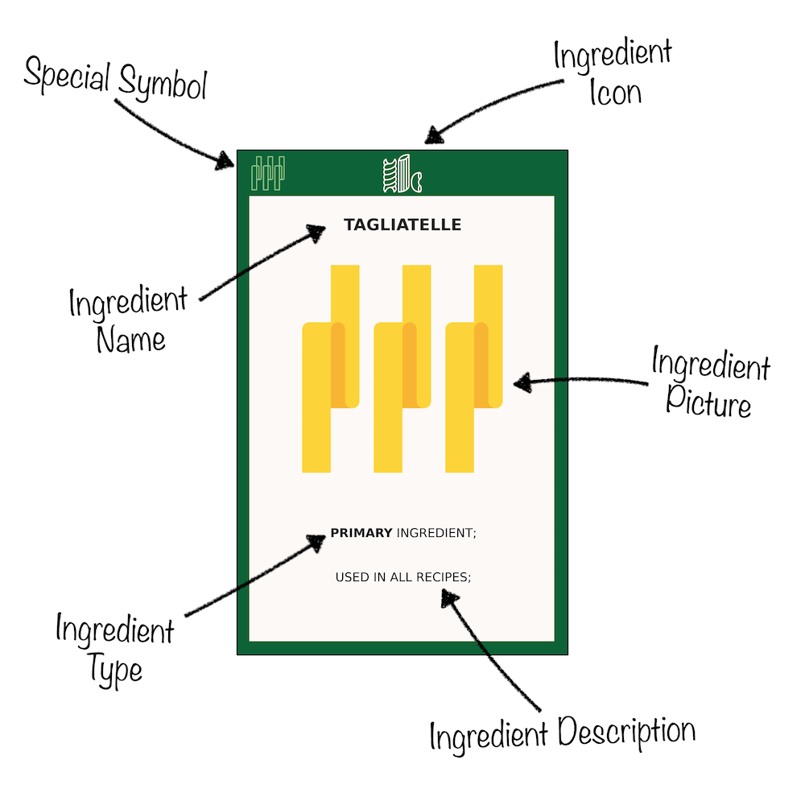
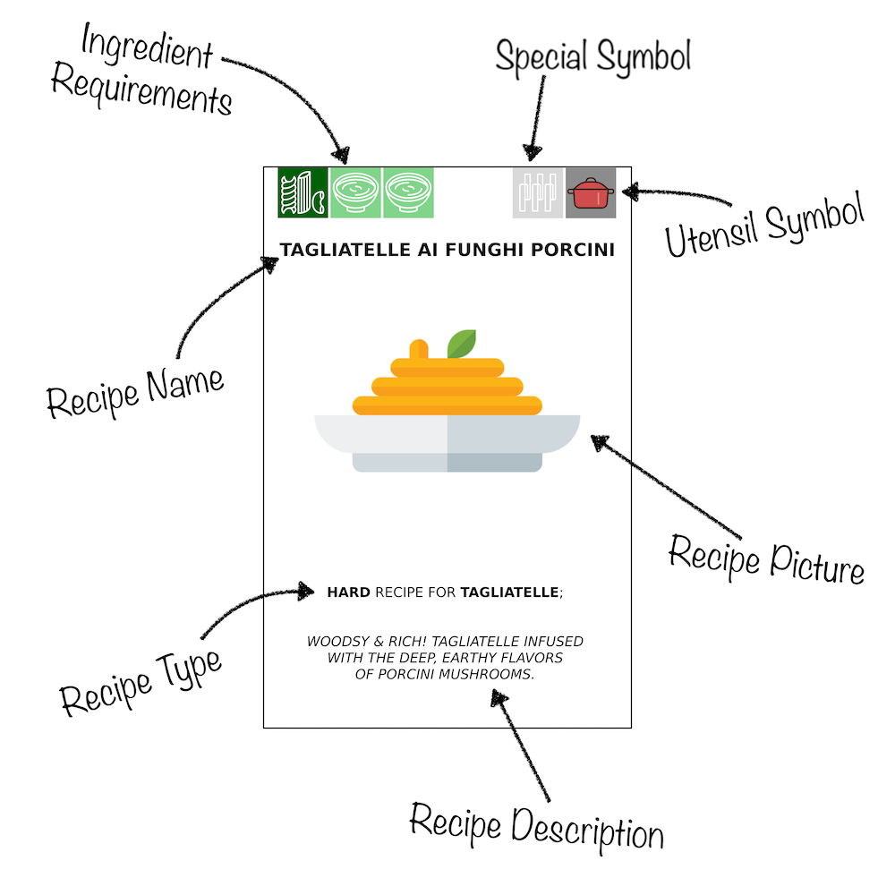
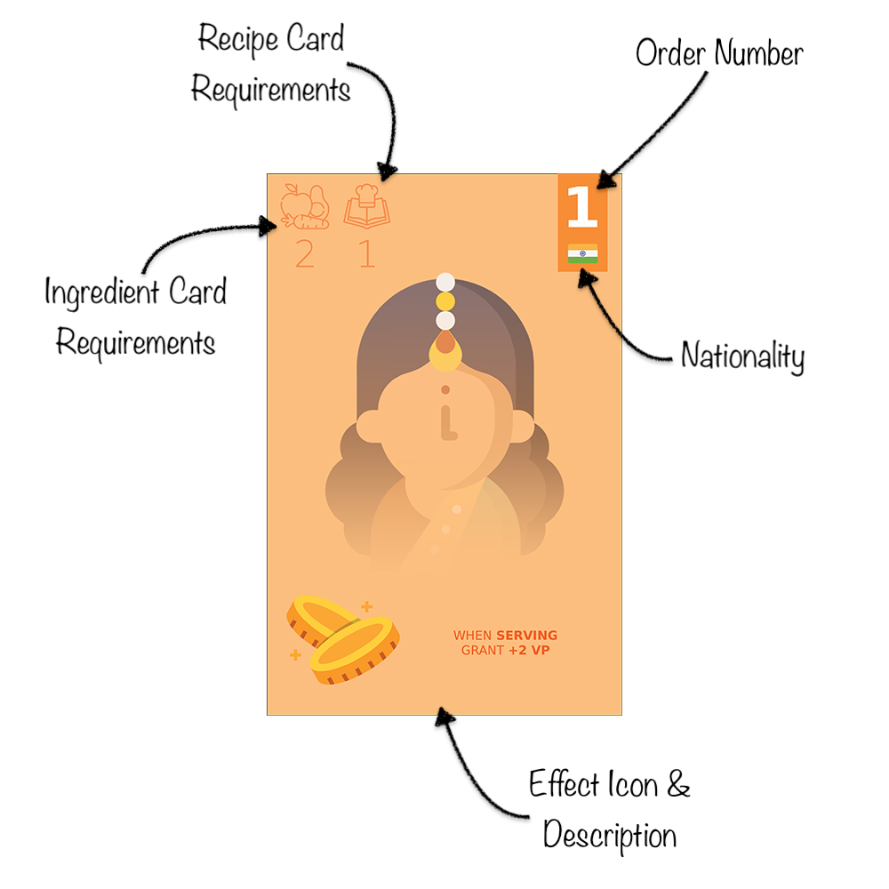
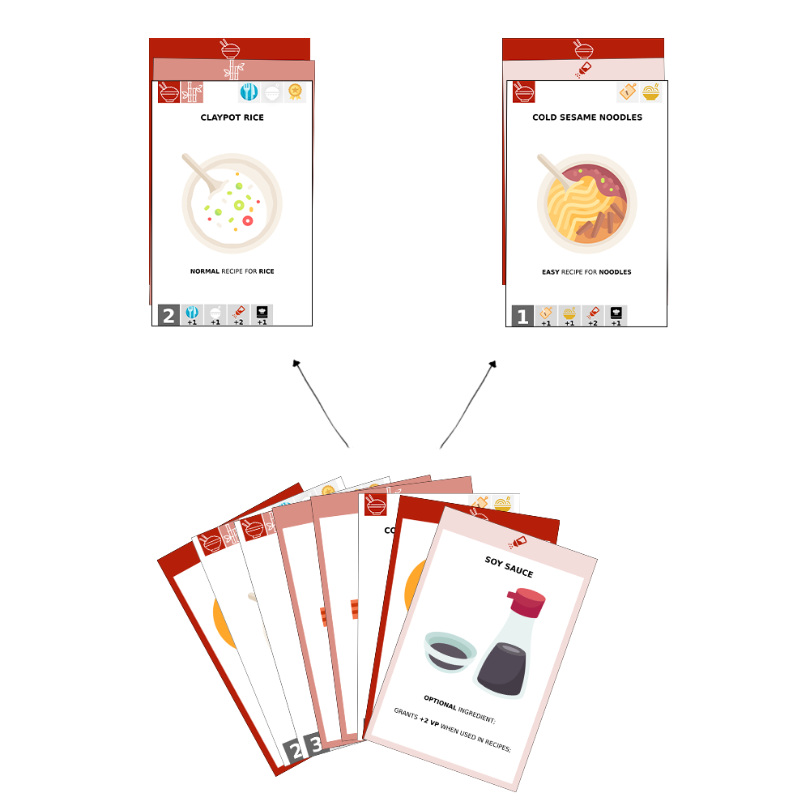
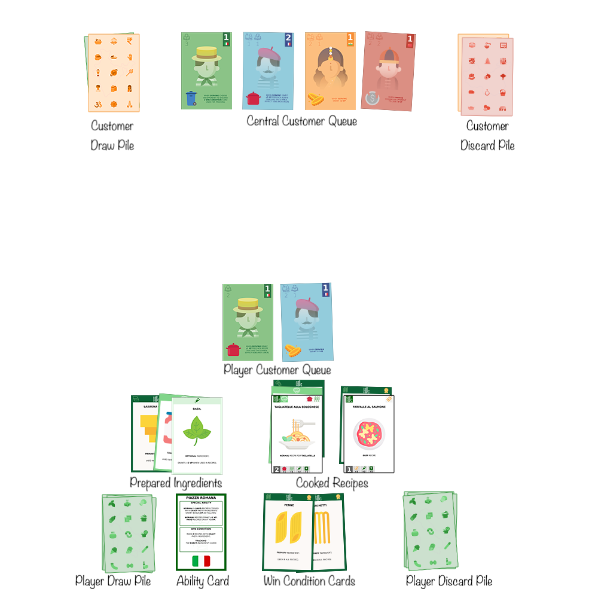

# Rules of the Game

<!-- TOC -->
* [Rules of the Game](#rules-of-the-game)
  * [Overview](#overview)
  * [Objective](#objective)
  * [Setup](#setup)
  * [Turn Structure](#turn-structure)
    * [1. Fill Hand](#1-fill-hand)
    * [2. Perform One Main Action](#2-perform-one-main-action)
    * [3. Attract a Customer](#3-attract-a-customer)
    * [4. Additional Actions](#4-additional-actions)
  * [Card Types](#card-types)
    * [Ingredient Cards](#ingredient-cards)
    * [Recipe Cards](#recipe-cards)
    * [Drink Cards](#drink-cards)
    * [Event Cards](#event-cards)
    * [Customer Cards](#customer-cards)
    * [Ability Card](#ability-card)
  * [Player Actions](#player-actions)
    * [Fill Hand](#fill-hand)
    * [Main Actions](#main-actions)
      * [Prepare](#prepare)
      * [Cook](#cook)
      * [Serve](#serve)
    * [Attract Customers](#attract-customers)
    * [Additional Actions](#additional-actions)
      * [Play Event Cards](#play-event-cards)
      * [Play Drink Cards](#play-drink-cards)
  * [Winning the Game](#winning-the-game)
  * [Examples](#examples)
<!-- TOC -->

## Overview

Players take on the role of restaurant owners competing in a bustling mall food court. Each
restaurant specializes in a unique cuisine, represented by its own deck of cards. These decks
contain ingredients, recipes, abilities, and customers that reflect each restaurant's theme.

The goal is to prepare and serve delicious meals, attract customers, and leverage unique abilities
to earn the most Victory Points (VP) before the game ends.

## Objective

Players aim to score the highest number of Victory Points (VP) by the end of the game. VP are earned
by cooking and serving recipes, playing drink cards, triggering customer and ability effects, and
achieving win condition milestones.

## Setup

1. **Deck Selection:** Each player selects one restaurant deck.
2. **Central Customer Queue Creation:**
    - All players remove the customer cards from their decks.
    - Combine these into a shared customer deck.
    - Shuffle the deck and draw customer cards equal to the number of players plus 1.
    - Place these face up in the center of the play area to form the **central customer queue**.
    - Place the remaining customer deck face down as draw pile, with space for a face-down discard
      pile on the opposite side of the queue.
3. **Player Station Setup:**
    - Place the **Ability Card** in front of the player.
    - Place the player deck face down on the left side as draw pile and draw 7 cards for a starting
      hand.
    - Reserve space to the right of the Ability Card for the **discard pile** and **Win Condition
      Cards**.
    - Above the Ability Card, players will place their **prepared ingredients and cooked recipes**.
    - Above that, players will maintain their **personal customer queue**.
4. Choose **First Player:** randomly. Turns proceed clockwise.

Check the [Examples](#examples) section for a visual representation of the setup.

## Turn Structure

Game is played in rounds where 1 round consists of all players taking their turns clockwise.  
Each player turn consists of the following:

### 1. Fill Hand

At the beginning of their turn, players may discard up to 3 cards from their hand, then draw back up
to their current hand limit (7 cards by default, or 8 if modified by a customer effect). If the draw
pile is empty, the discard pile is reshuffled to form a new draw pile.

### 2. Perform One Main Action

Players may choose one of the following three core actions:

- **Prepare:** Move any number of ingredient cards from their hand into play as **prepared but
  unused** ingredients. These can be used in future turns to cook recipes.
- **Cook:** Use prepared ingredients to cook one or more recipes by placing recipe cards on top of
  the appropriate ingredients. The ingredients must meet the recipe requirements (
  see [Recipe Cards](#recipe-cards)).
- **Serve:** Score Victory Points by serving cooked recipes to customers in the player’s personal
  queue. The total number of recipes that may be served is limited by the combined order limits on
  the customer's cards. During this action, players also resolve customer effects, ability effects,
  and track win condition progress (if applicable). Every cooked recipe along with its ingredients
  that was scored from and every customer that was served and their effect used are discarded at the
  end.

### 3. Attract a Customer

After performing a main action, a player may attract **one** customer from the central queue,
provided they meet its requirements. The attracted customer is added to their personal queue (
maximum of 3 customers).

### 4. Additional Actions

Throughout their turn (but always after filling their hand), players may:

- Play **event cards** to manipulate customer queues.
- Play **drink cards** when their conditions are met to immediately score bonus VP.

## Card Types

### Ingredient Cards

Ingredient cards represent the various components needed to cook recipes. They come in three
categories:

- **Primary Ingredients** – Required in every recipe.
- **Secondary Ingredients** – Required in normal and hard recipes.
- **Optional Ingredients** – Can be added to any recipe to grant +1 VP when served.

Ingredient cards have the following structure:

- **Ingredient Icon** - Represents the type of the ingredient so you can recognize it in
  recipe requirements. Darker border means it is a **primary** ingredient.
- **Ingredient Picture** - A picture of the ingredient.
- **Ingredient Description** - Tells you which recipes the ingredient can be used in.
- **Ingredient Type** - The type of the ingredient (primary, secondary, optional).
- **Ingredient Name** - The name of the ingredient.
- **Special Symbol** - In some decks, the ingredient has a special symbol that can be used as visual
  aid for certain deck mechanics. In the above example it tells you that this is a Tagliatelle
  so you know if the recipe cooked with it scores extra points for using exact pasta ingredient.
- **Win Condition Symbol** - If present it indicates this card can be used to track the win
  condition for the deck.

### Recipe Cards

Recipe cards represent dishes that players can cook and serve for points. They vary in complexity
and scoring potential:

- **Easy:** Requires 1 Primary Ingredient — worth 1 VP.
- **Normal:** Requires 1 Primary + 1 Secondary Ingredient — worth 2 VP.
- **Hard:** Requires 1 Primary + 2 Secondary Ingredients — worth 4 VP.

Recipe cards have the following structure:

- **Utensil Symbol** - Depicts the utensil type that can be used to score extra VP.
- **Recipe Picture** - Pictures of the dish.
- **Recipe Type** - The difficulty of the recipe (easy, normal, hard).
- **Recipe Name** - The name of the dish.
- **Ingredient Requirements** - The ingredients needed to cook the recipe.
- **Special Symbol** - In some decks, the recipe has a special symbol that is used for their special
  ability. In the above example it tells you that this recipe is a Main course recipe.
- **Scoring Symbols** - Used to calculate the total score of the recipe when serving. It includes a
  base score and various situational bonuses.
- **Win Condition Symbol** - If present it indicates this card can be used to track the win
  condition.

### Drink Cards

Drink cards represent beverages that customers can enjoy. Unlike recipes, drinks require no
ingredients and can be played at any time after a player fills in their hand as long as:

- they have at least one customer in their queue.
- the drink card's condition is met.

When a drink card is put in play it grants 3 VP and is instantly discarded.
Customers are not discarded when served with a drink card!

### Event Cards

Event cards provide one-time strategic effects that can impact any player's queue. They are:

- **Complaint:** Discards a customer from any queue.
- **Promotion:** Swaps 2 customers from any two queues.
- **Discount:** Allows a player to attract a customer from the central queue, ignoring its
  requirements and the limit of attracting only 1 customer per turn.

Event cards can be played at any time during a player’s turn, provided they have already drawn up to
their hand limit.

### Customer Cards

Customer cards represent diners that players try to attract and serve. They are drawn from a shared
central queue and added to individual player queues when requirements are met. Each customer
increases the player’s serving capacity and grant various effects.

Customer cards have the following structure:

- **Ingredient Card Requirements** - The **prepared** and **unused** ingredient cards needed to
  attract the customer to the player's queue.
- **Recipe Card Requirements** - The **cooked** recipe cards needed to attract the customer to the
  player's queue.
- **Order Number** - The number of recipes that can be served to the customer. The sum of this
  number across all customer cards in the player's queue is the total number of recipes that can be
  served (scored from) during the **Serve** action.
- **Nationality** - Indicates the customer's nationality which may provide bonus VP when served,
  depending on the active customer effect.
- **Effect Icon & Description** - The effect granted by the customer card which is either activated
  when served or is an ongoing effect until the card is discarded after serving.

**Notable Rules:**

- Players may attract 1 customer per turn (unless using a Discount event card).
- Players may have a maximum of 3 customers in their personal queue.
- Customer effects that are not ongoing only activate if at least one recipe is served to them.
- Customer effects that are ongoing apply immediately when the card is put in play and are active
  while the customer remains in the queue.
- Effects do not stack if duplicated.

**Deck-Specific Customer Effects Include:**

- VP gain/loss.
- Discarding win condition, cooked recipe, or prepared ingredients.
- Bonus VP for utensil types or nationalities.
- Deck-unique effects (e.g., recovering ingredients or recipes from the discard pile).

See [Decks](Decks.md) for specific configurations.

### Ability Card

Each deck includes an ability card that outlines:

- The deck’s unique ability.
- The win condition and how to track it.

Players can use this to guide their strategy and scoring plan.

## Player Actions

### Fill Hand

At the beginning of their turn, players discard up to 3 cards and then draw up to their hand limit.
If the draw pile is empty or not enough does not have enough cards, the discard pile is reshuffled
into it.

### Main Actions

Each player chooses one main action on their turn:

#### Prepare

Players move any number of ingredient cards from their hand into play. These become **prepared but
unused** ingredients, which remain available for future cooking.

#### Cook

Players use prepared unused ingredients to fulfill a recipe’s requirements:

- Ingredients are arranged in a column.
- The matching recipe card is placed on top of the stack.
- Multiple recipes may be cooked per turn if enough ingredients are available.

#### Serve

Players serve up to as many recipes as allowed by the total order number from their customers.
Points are scored from:

- The cooked recipes.
- Active customer effects.
- Ability card effects.
- Situational bonuses.

If a served recipe qualifies for win condition tracking, **one** such card may be placed into the
tracking area per turn.

### Attract Customers

After the main action, players may attract 1 customer from the central queue if the card's
requirements are met. This customer is added to the player’s queue (max 3). Their
order number expands the player’s serving limit for future Serve actions. For more details, see
[Customer Cards](#customer-cards).

### Additional Actions

Player can choose to do any of the following during their turn after filling their hand:

#### Play Event Cards

Players may play event cards (Complaint, Promotion, Discount) to manipulate customer queues. For
more details, see [Event Cards](#event-cards).

#### Play Drink Cards

When the condition of a drink card is met, it may be played to grant extra VP. For more details,
see [Drink Cards](#drink-cards).

## Winning the Game

The game ends after the round in which a player reaches **40 VP** or completes their 
**win condition** ends. All players must finish their turns so a round could end.

**Final Scoring:**

- Each win condition card is worth 5 VP.
- If all four are achieved, the total is 30 VP instead of 20.

**Tiebreaker:** The player who most recently cooked a real-life meal wins.

## Examples

In this 3-player game example only one player station and the central queue is shown:

- The visible player is using the **Piazza Romana** deck.
- They have 2 win condition cards tracked (2 more needed).
- They have 3 prepared ingredients: 1 primary, 1 secondary, 1 optional.
- They have cooked 2 recipes: 1 easy, 1 normal.
- Their queue includes 2 customers with a combined order limit of 2.

If the player serves now they will score:
- **Normal Recipe:** 2 base VP + 1 VP bonus from Cookware utensil effect = 3 VP.
- **Easy Recipe:** 1 VP.
- **French Customer Effect:** +2 VP.

**Total VP Earned:** 6
