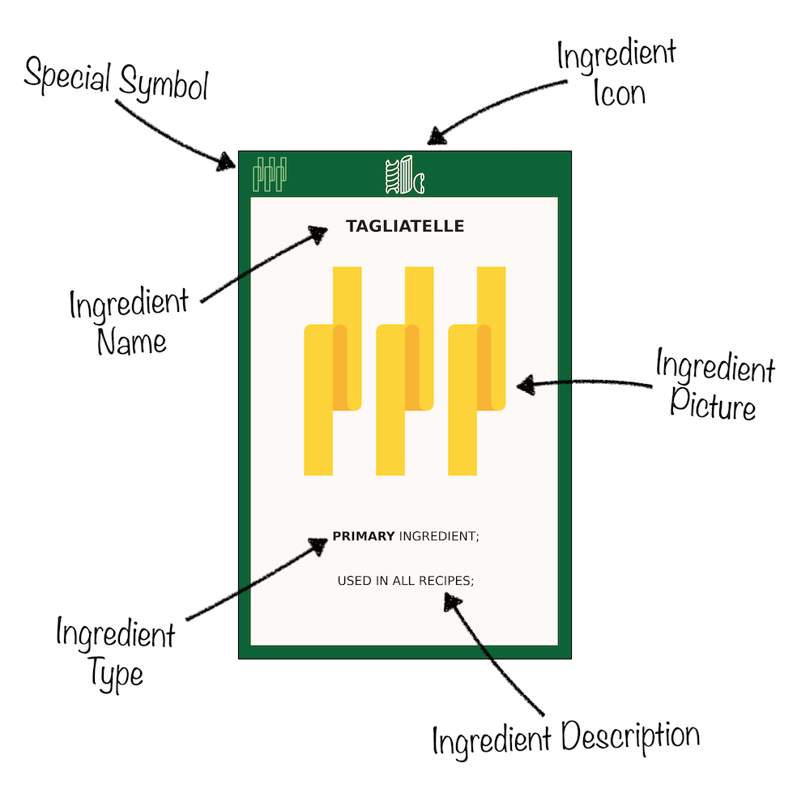
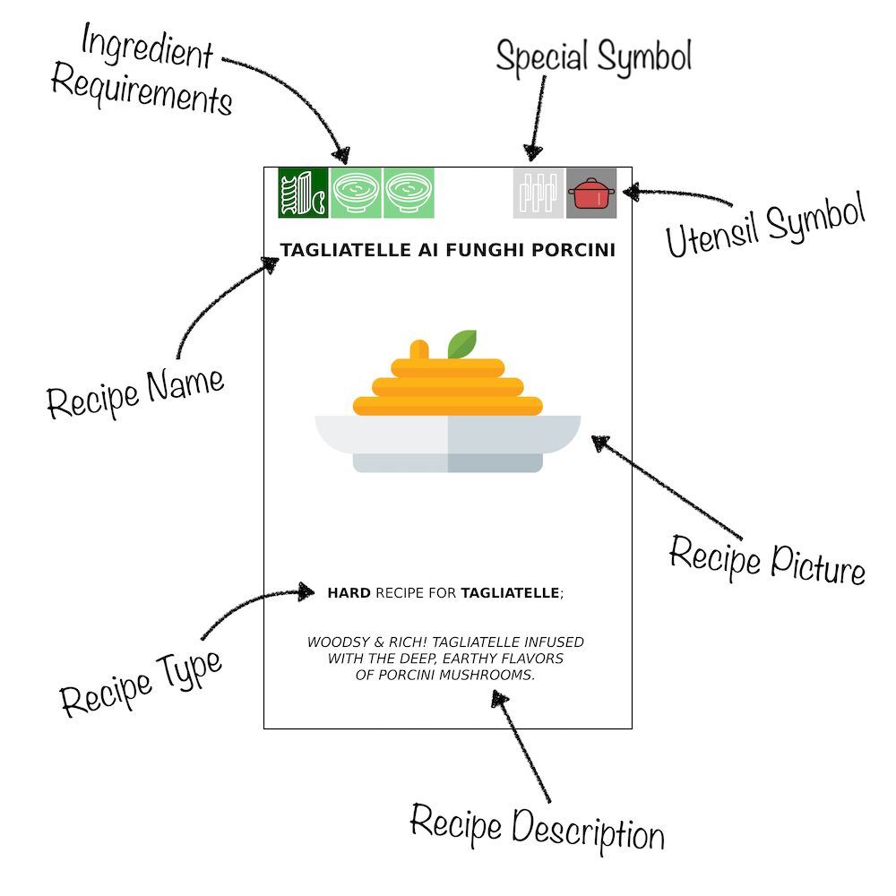
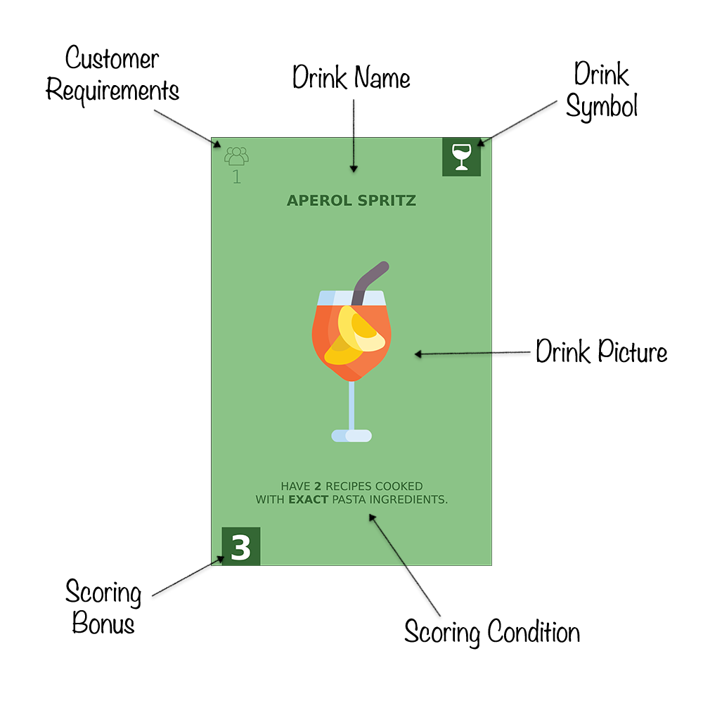
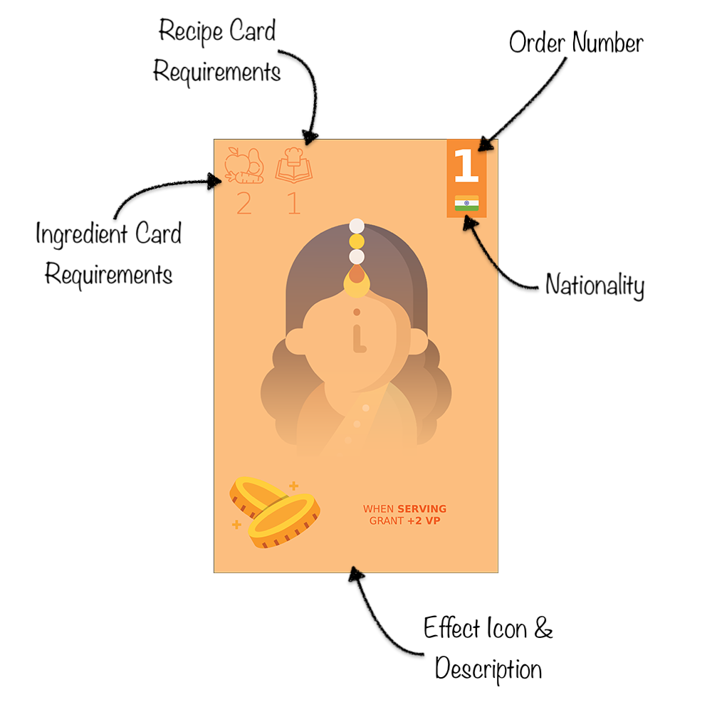
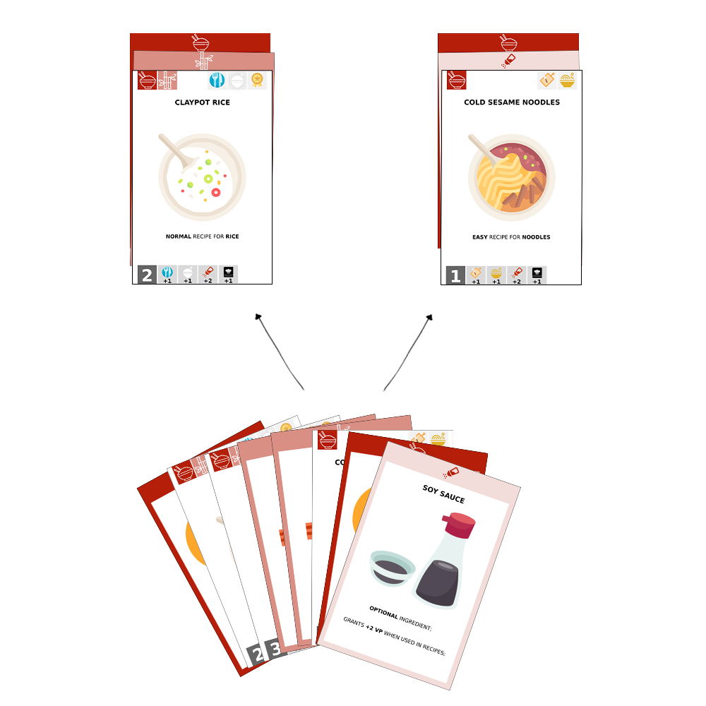
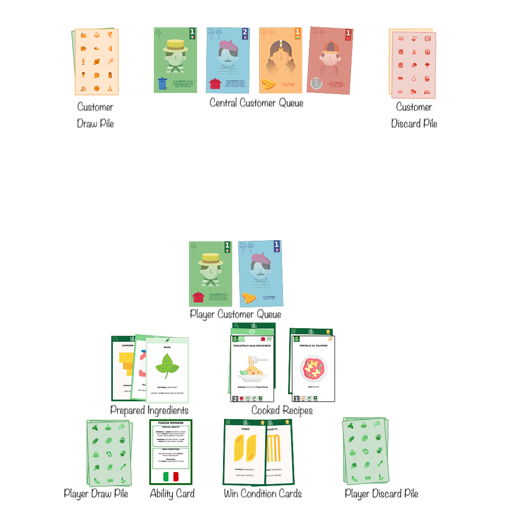

# Rules of the Game

<!-- TOC -->
* [Rules of the Game](#rules-of-the-game)
  * [Overview](#overview)
  * [Objective](#objective)
  * [Setup](#setup)
  * [Turn Structure](#turn-structure)
  * [Limits](#limits)
  * [Card Types](#card-types)
    * [Ingredient Cards](#ingredient-cards)
    * [Recipe Cards](#recipe-cards)
    * [Drink Cards](#drink-cards)
    * [Customer Cards](#customer-cards)
    * [Utensil Cards](#utensil-cards)
    * [Ability Card](#ability-card)
  * [Player Actions](#player-actions)
    * [Fill Hand](#fill-hand)
    * [Prepare](#prepare)
    * [Cook](#cook)
    * [Serve](#serve)
      * [Play Drink Cards](#play-drink-cards)
      * [Play Utensil Cards](#play-utensil-cards)
  * [Winning the Game](#winning-the-game)
  * [Examples](#examples)
  * [Glossary](#glossary)
<!-- TOC -->

## Overview

You take on the role of a restaurant owner competing in a bustling mall food court. Each
restaurant specializes in a unique cuisine, represented by its own deck of cards. These decks
contain ingredients, recipes, drinks, utensils, events and customers that reflect each restaurant's 
theme.

Your goal is to prepare delicious meals, attract and serve customers, and leverage your deck’s
unique ability to score the most victory points at the end of the game.

## Objective

Have the highest score at the end of the game.
All scoring comes from served customers: each customer has a base value (1–4) plus bonus value 
granted by pairing moods and personalities. Recipes and Drinks enable you to attract customers; 
Utensils and End Condition cards help you with your strategy.

## Setup

1. Deck Selection: Each player selects one restaurant deck.
2. Customer Deck:
    - Remove all Customer Cards from the cuisine decks and combine them into a shared customer deck.
    - Shuffle, then draw a central customer queue of a number of face‑up cards equal to the number 
   of players + 1. Place the rest face down as a draw pile next to it.
3. Your Station:
    - Place your Ability Card in front of you.
    - Place your deck face down as a draw pile; draw 6 cards.
    - Reserve space for a discard pile, End Condition cards in tracking, an in‑play area
      for recipes/drinks/utensils, and a scoring pile for served customers.
4. First Player: choose randomly. Turns proceed clockwise.

Check the [Examples](#examples) section for a visual representation of the setup.

## Turn Structure

The game is played in rounds in which all players take a turn. 

On your turn:

1. Play cards from your hand up to the play limit to do any of the following (see
   [Player Actions](#player-actions) and [Limits](#limits) for details):
   - Cook Recipes using prepared ingredients. See [Cook](#cook).
   - Play Drink Cards when their requirements are met (to serve customers of any base value). See
   [Play Drink Cards](#play-drink-cards).
2. Serve: 
   - Select customers from the central queue and use your cooked recipes' serve value to fully
     cover each selected customer’s base value. Move served customers to your scoring pile. See
     [Serve Customers](#serve-customers).
   - After you serve all your recipes, immediately refill the central queue from the customer deck, 
   if possible, to maintain its size.
   - If you served 2 recipes with the same utensil symbol you can put in play a utensil card. See 
   [Utensil Cards](#drink-cards).
   - If you met your special ability condition, you may put one End Condition card into tracking.
   See [Ability Card](#ability-card).

Outside your turn you:
- discard unnecessary cards and fill up your hand. See [Fill Hand](#fill-hand).
- prepare ingredients. See [Prepare](#prepare).

## Limits

The game uses a few simple limits. Utensils can increase most of these limits while in play; see
[Utensil Cards](#utensil-cards).

- Preparation Limit (How much ingredient cards you can prepare outside your turn): Default is 2 
(3 with Kitchenware utensil in play).
- Cooking Limit (How much recipe cards you can cook in your turn): Default is 2 (3 with Cookware
utensil in play).
- Serving Limit (How many customers you can serve in your turn): 2 customers (3 with Tableware
utensil in play).
- Hand Limit (How many cards you can have at most in your hand): 6.

## Card Types

### Ingredient Cards

Ingredient cards represent the various components needed to cook recipes. They come in three
categories:

- **Primary Ingredients** – Required in every recipe.
- **Secondary Ingredients** – Required in **normal** and **hard** recipes.
- **Optional Ingredients** – Can be added to any recipe to raise its serve value by 1. More than one
is allowed.

Ingredient cards have the following structure:

- **Ingredient Icon** - Represents the type of the ingredient so you can recognize it in
  recipe requirements. Darker border means it is a **primary** ingredient.
- **Ingredient Picture** - A picture of the ingredient.
- **Ingredient Description** - Tells you which recipes the ingredient can be used in.
- **Ingredient Type** - The type of the ingredient (primary, secondary, optional).
- **Ingredient Name** - The name of the ingredient.
- **Special Symbol** - In some decks, the ingredient has a special symbol that can be used as visual
  aid for certain deck mechanics. In the above example it tells you that this is a Tagliatelle
  so you know if the recipe cooked with it scores extra points for using exact pasta ingredient.
- **End Condition Symbol** - If present it indicates this card can be used to track the end
  condition for the deck.

### Recipe Cards

Recipe cards represent dishes you cook to serve customers. Each recipe has a serve value that
contributes towards covering a customer’s base value (e.g., easy=1, normal=2). Recipes themselves
do not score directly.

Recipe cards have the following structure:

- **Utensil Symbol** - Depicts the utensil type relevant for summoning a matching utensil card.
- **Recipe Picture** - A picture of the dish.
- **Recipe Type** - The difficulty of the recipe (easy, normal, hard).
- **Recipe Name** - The name of the dish.
- **Ingredient Requirements** - The ingredients needed to cook the recipe.
- **Special Symbol** - In some decks, the recipe has a special symbol that is used for their special
  ability. In the above example it tells you that this recipe is a Main course recipe.
- **Serve Value & Bonus** - Shows the recipe’s serve value and whether your deck’s special ability
  or any optional ingredients grant an extra +1 serve value in specific situations when serving.
- **End Condition Symbol** - If present it indicates this card can be used to track the end
  condition of the deck.

### Drink Cards

Drink cards are played by meeting their requirement (no ingredients). When put in play, you may
immediately put 1 customer from the central queue to your scoring pile (serving it without covering 
its base value). The drink card is discarded after use.

Drink cards have the following structure:

- **Drink Name** - The name of the drink.
- **Drink Symbol** - Indicates that this is a drink card.
- **Drink Picture** - A picture of the drink.
- **Requirement** - The condition you must meet to play the drink or re‑trigger its effect.

### Customer Cards

Customer cards represent diners in a shared central queue. Each customer has a base value (1–4) 
showing how much serve value from recipes must be allocated in a single turn to serve them. When you
serve a customer you move it to a scoring pile face up. At the end of the game, your served 
customers score their base value plus bonus value based on:
- end condition cards in tracking (+1 VP for each up to the amount of medal symbols depicted).
- if their mood matches by color the personality of the previous customer in the pile. Each color 
match gives +2 VP.
- if their nationality matches your deck. Each match gives +1 VP.

Customer cards have the following structure:

- Base Value - The total serve value needed in a turn to attract the customer (1–4).
- Mood - Can be 🟩friendly, 🟦casual, 🟨impatient or 🟥angry.
- Personality - Can be 🟩family, 🟦tourist, 🟨foodie or 🟥critic.
- Bonus Value - (1-3) Bonus VP for the amount of end condition cards in tracking up to the shown 
amount (i.e. two medal symbols means the customer can score up to +2VP if the player put 2 End
Condition cards in tracking).
- Nationality - The customer’s nationality.

For serve limit and turn flow, see [Limits](#limits) and [Turn Structure](#turn-structure).

See [Decks](Decks.md) for specific configurations.

### Utensil Cards

Each deck has 3 Utensil Cards: Kitchenware, Cookware, and Tableware.
Putting into play: during your turn, if you serve 2 recipes with the same utensil symbol, you may
put the matching Utensil Card into play. Utensils stay in play until end of game and have the
following ongoing effects:
- Kitchenware: Preparation limit +1 (default 2 → 3).
- Cookware: Cooking limit +1 (default 1 → 2).
- Tableware: Serving limit +1 (default 2 → 3).

See also [Limits](#limits) for details.

### Ability Card

Each deck includes an Ability Card that outlines:

– The deck’s unique special ability.
– The End Condition and how to track it.

Use this to guide your strategy and scoring plan.

Note: Special abilities are evaluated only from recipes you serve, not recipes you cook, and a card 
cannot participate in more than one special ability occurrence.

Example: If you play with the French deck (where the special ability is entrée + appetizer = +1 and
appetizer + main = +1), and you have 4 cooked recipes: 2 entrée, 1 appetizer and 1 main, and you 
decide to serve the 2 entrée and the appetizer recipes, you score +1 serve value only once because 
the appetizer can only be used in one special ability occurrence and the main course was not served.

## Player Actions

### Fill Hand

Outside your turn, you may discard up to 3 cards and then draw up to your hand limit of 6. If the 
draw pile is empty, reshuffle the discard pile as draw pile and continue. 

### Prepare

Outside your turn, you may put ingredient cards in play up to your preparation limit. They now count
as prepared and unused (available for cooking recipes).

### Cook

Use prepared, unused ingredients to fulfill a recipe’s requirements:

- Ingredients are arranged in a column.
- The matching recipe card is placed on top of the stack.

The above picture demonstrates that the player can do one of the following:

- Prepare 1 primary and 1 secondary ingredient and cook 1 normal recipe.
- Prepare 2 primary ingredients and cook 1 easy recipe.

### Serve

When you serve, calculate your cooked recipes' total serve value and move any customers that have
their base value covered to your scoring pile as served customers. If one or more served recipes
have cards that qualify for End Condition tracking, you may place exactly one of them into tracking.

If you serve 2 recipes with the same utensil symbol you may put the matching Utensil Card in play.

You discard all cooked recipes and their ingredients used to serve customers.

#### Play Drink Cards

You may play Drink Cards when their requirements are met to immediately serve 1 customer from the
central queue without using cooked serve value. See [Drink Cards](#drink-cards).

#### Play Utensil Cards

You may play Utensil Cards (Kitchenware, Cookware, Tableware) when serving 2 recipes with their 
symbol in the same turn. For more details, see [Utensil Cards](#utensil-cards).

## Winning the Game

The game ends after the round in which either a player puts 4 End Condition cards into tracking or
the customer deck is emptied. Players must finish the current round (everyone gets to play their 
turn).

After the game ends, sum Victory Points (VP) from your served customers as described under
[Customer Cards](#customer-cards). The player with the highest total VP wins.

Tiebreaker: the player who most recently cooked a real-life meal wins.

## Examples

In this 4‑player game example only one player station and the central queue is shown:

- The visible player is using the **Piazza Romana** deck.
- They have 2 End Condition cards in tracking (2 more needed).
- They have 3 prepared ingredients: 1 primary, 1 secondary, 1 optional.
- They have cooked 2 recipes: 1 easy, 1 normal.
- The central queue shows 5 customers (players + 1).

If the player serves now and fully covers a customer’s base value with cooked serve value, they
move that customer to their scoring pile and the central queue is then refilled. Any End Condition 
cards in tracking will help score bonus points for end‑game scoring.

## Glossary

- Serve Value: The value on recipes used when serving customers. Optional ingredients and special
  abilities may add +1 serve value in specific situations.
- Base Value: The number on a customer (1–4) indicating how much serve value must be allocated in a
  single turn to serve them.
- Bonus Value: Extra value a customer provides at end of game based on End Condition cards in 
  tracking and mood/personality matches. 
- Central Queue: The shared row of face‑up customers sized (players + 1).
- Served Customers: Customers you have moved to your scoring pile by serving them from the central 
  queue or via drinks/events.
- End Condition: A deck-specific condition that, when achieved, ends the game and the number of 
  cards used for its tracking may appear as customer bonus point prerequisites.
