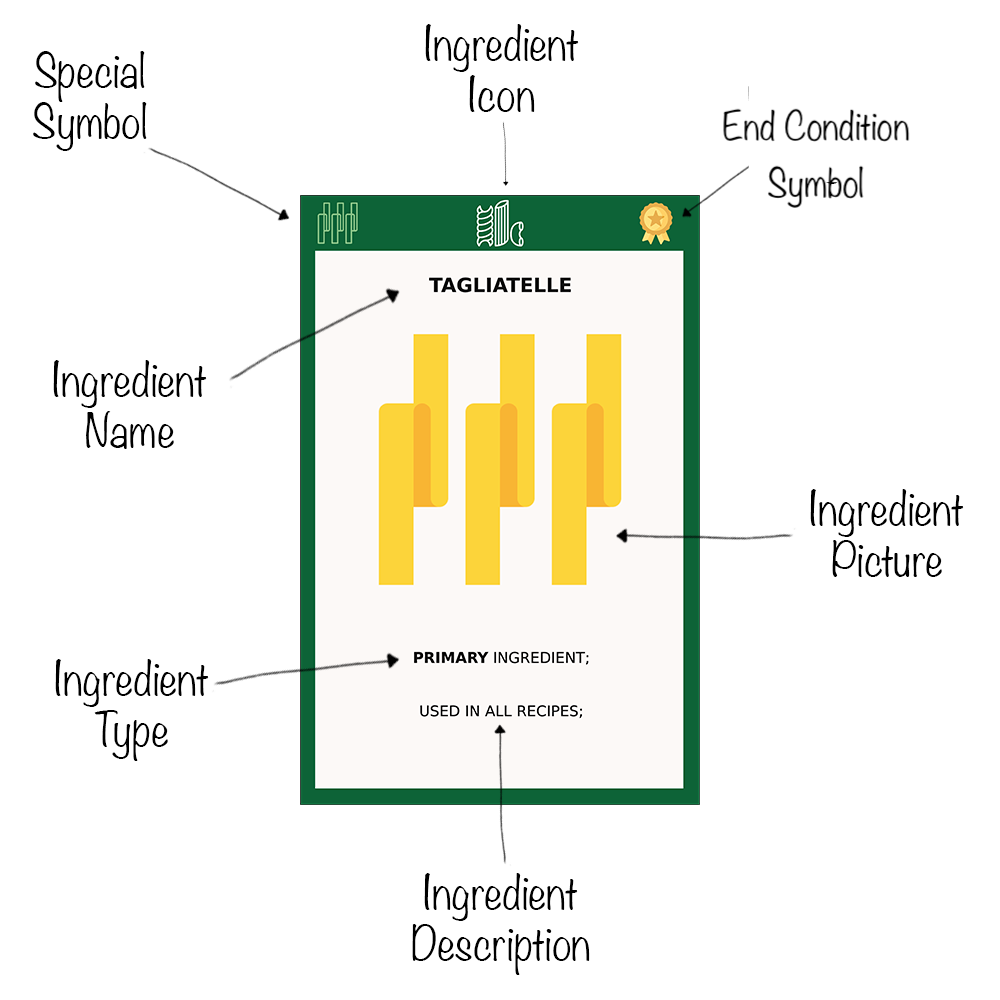

# Rules of the Game

<!-- TOC -->
* [Rules of the Game](#rules-of-the-game)
  * [Overview](#overview)
  * [Objective](#objective)
  * [Setup](#setup)
  * [Turn Structure](#turn-structure)
    * [Actions](#actions)
  * [Card Types](#card-types)
    * [Ingredient Cards](#ingredient-cards)
    * [Recipe Cards](#recipe-cards)
    * [Drink Cards](#drink-cards)
    * [Event Cards](#event-cards)
    * [Customer Cards](#customer-cards)
    * [Utensil Cards](#utensil-cards)
    * [Ability Card](#ability-card)
  * [Player Actions](#player-actions)
    * [Fill Hand](#fill-hand)
    * [Cook](#cook)
    * [Serve](#serve)
      * [Attract Customers](#attract-customers)
      * [Play Drink Cards](#play-drink-cards)
      * [Play Utensil Cards](#play-utensil-cards)
    * [Play Event Cards](#play-event-cards)
  * [Winning the Game](#winning-the-game)
  * [Examples](#examples)
  * [Glossary](#glossary)
<!-- TOC -->

## Overview

You take on the role of a restaurant owner competing in a bustling mall food court. Each
restaurant specializes in a unique cuisine, represented by its own deck of cards. These decks
contain ingredients, recipes, drinks, utensils, events and customers that reflect each restaurant's 
theme.

Your goal is to prepare delicious meals, attract and serve customers, and leverage your deck’s
unique ability to score the most victory points at the end of the game.

## Objective

Have the highest score at the end of the game.
All scoring comes from served customers: each customer has a base value (1–4) plus any bonus
value granted by meeting the card’s depicted bonus requirements. Recipes and Drinks enable you to 
attract customers; Utensils, Events and End Condition cards help you with your strategy.

## Setup

1. Deck Selection: Each player selects one restaurant deck.
2. Customer Deck:
    - Remove all Customer Cards from the cuisine decks and combine them into a shared customer deck.
    - Shuffle, then deal 1 face‑up customer to each player (start each personal queue).
    - Reveal 2 face‑up customers in the center as the central queue; place the rest face down
      as a draw pile.
3. Your Station:
    - Place your Ability Card in front of you.
    - Place your deck face down as a draw pile; draw 6 cards.
    - Reserve space for a discard pile, End Condition cards in tracking, an in‑play area
      for recipes/drinks/utensils, and a scoring pile for served customers.
4. First Player: choose randomly. Turns proceed clockwise.

Check the [Examples](#examples) section for a visual representation of the setup.

## Turn Structure

The game is played in rounds in which all players take a turn. When not taking your turn, you may
discard up to 3 cards, then draw to your hand limit (6 by default).

On your turn:

1. Attract 1 customer from the central queue and add it to the right of your personal queue. Then
   refill the central queue from the customer deck if possible.
2. Play up to 3 cards from your hand to do any of the following:
   - Prepare Ingredients
   - Cook Recipes
   - Play Event Cards
   - Play Utensil Cards
   - Play Drink Cards
3. Serve:
   - Use cooked recipes' total serve value to move attracted customers to your scoring pile by 
   covering their base values in full.
   - Move all customers from your queue to your scoring pile if a drink card was put into play or 
   its requirement is met.
4. End of turn:
   - If your customer queue is empty, attract 1 customer from the central queue.
   - If your customer queue is at its limit, move the leftmost customer in your queue to the end of
     the queue of the player on your left.

### Actions

You spend most of your turn playing different types of cards:

- Prepare Ingredients — put Ingredient Cards into play as prepared but unused.
- Cook Recipes — put Recipe Cards into play by covering their ingredient requirements with
  prepared and unused ingredients. For example, to cook a normal recipe you need 1 primary and
  1 secondary ingredient.
- Serve Recipes — allocate cooked serve value to customers in your queue. For example, to serve a
  customer with base value 2 you can serve 2 easy recipes (1+1), 1 normal recipe (2), or any
  combination that sums to 2 or more. When serving, discard the cooked recipes used (along with
  their ingredients) and move those customers to your scoring pile as served customers.
- Serve Drinks — play Drink Cards when their requirements are met to move all customers from your 
  queue to your scoring pile. Drinks stay in play until end of game for scoring and re‑trigger each 
  time their requirement is met.
- Play Event Cards — play Event Cards to manipulate customer queues.
- Play Utensil Cards — if you serve 2 recipes with the same utensil symbol in a single turn, you may
  put the matching Utensil Card into play. Utensils stay in play until end of game for scoring and
  have ongoing effects while in play.

## Card Types

### Ingredient Cards

Ingredient cards represent the various components needed to cook recipes. They come in three
categories:

- **Primary Ingredients** – Required in every recipe.
- **Secondary Ingredients** – Required in **normal** and **hard** recipes.
- **Optional Ingredients** – Can be added to any recipe to raise its serve value by 1. Only one
  optional ingredient can be used per recipe.

Ingredient cards have the following structure:

- **Ingredient Icon** - Represents the type of the ingredient so you can recognize it in
  recipe requirements. Darker border means it is a **primary** ingredient.
- **Ingredient Picture** - A picture of the ingredient.
- **Ingredient Description** - Tells you which recipes the ingredient can be used in.
- **Ingredient Type** - The type of the ingredient (primary, secondary, optional).
- **Ingredient Name** - The name of the ingredient.
- **Special Symbol** - In some decks, the ingredient has a special symbol that can be used as visual
  aid for certain deck mechanics. In the above example it tells you that this is a Tagliatelle
  so you know if the recipe cooked with it scores extra points for using exact pasta ingredient.
- **End Condition Symbol** - If present it indicates this card can be used to track the end
  condition for the deck.

### Recipe Cards

Recipe cards represent dishes you cook to serve customers. Each recipe has a serve value that
contributes towards covering a customer’s base value (e.g., easy=1, normal=2). Recipes themselves
do not score directly.

Recipe cards have the following structure:

- **Utensil Symbol** - Depicts the utensil type relevant for summoning a matching utensil card.
- **Recipe Picture** - A picture of the dish.
- **Recipe Type** - The difficulty of the recipe (easy, normal, hard).
- **Recipe Name** - The name of the dish.
- **Ingredient Requirements** - The ingredients needed to cook the recipe.
- **Special Symbol** - In some decks, the recipe has a special symbol that is used for their special
  ability. In the above example it tells you that this recipe is a Main course recipe.
- **Serve Value & Bonus** - Shows the recipe’s serve value and whether your deck’s special ability
  or any optional ingredients grant an extra +1 serve value in specific situations when serving.
- **End Condition Symbol** - If present it indicates this card can be used to track the end
  condition of the deck.

### Drink Cards

Drink cards are played by meeting their prerequisites (no ingredients). When put in play, a drink
immediately moves all customers directly from your queue to your scoring pile (they become served
customers). Drinks remain in play until the end of the game for scoring purposes and re‑trigger
each time their requirement is met to move all customers from your queue to your scoring pile again.

Drink cards have the following structure:

- **Drink Name** - The name of the drink.
- **Drink Symbol** - Indicates that this is a drink card.
- **Drink Picture** - A picture of the drink.
- **Requirement** - The condition you must meet to play the drink or re‑trigger its effect.

### Event Cards

Event cards provide one-time effects affecting queues:

- Complaint: Discard 1 customer from any queue.
- Promotion: Swap 2 customers between any two queues.
- Discount: Move 1 customer from your own queue or the central one to your scoring pile without
  covering its base value.

Note: “Any queue” includes the central queue.

Event cards have the following structure:

- **Event Name** - The name of the event.
- **Event Picture** - Visual representation of the event.
- **Event Description** - Describes what the event does.

### Customer Cards

Customer cards represent diners waiting in queues. Each customer has a base value (1–4) showing how
much serve value from recipes must be allocated in a single turn to serve them. At the end of the
game, your served customers score their base value plus their bonus value if you meet their bonus
requirements.

Customer cards have the following structure:

- Base Value - The total serve value needed this turn to attract the customer (1–4).
- Bonus Value - The extra value this customer provides at end of game if you meet its bonus
  requirements.
- Bonus Requirements - If met at end of game, add the bonus value to this customer:
  - Globe: your deck nationality matches the customer.
  - Utensil: you have the depicted utensil in play.
  - Gold medal (X): you have at least X End Condition cards in tracking.
  - Drink (X): you have at least X drink cards in play.
  Requirements can be simple (1 icon) or complex (multiple icons with strict (AND) or flexible (OR)
  conditions).
- **Nationality** - The customer’s nationality.

**Notable Rules:**

- Customer queue limit is 2 by default (3 if the Tableware utensil is in play).
- On your turn, attract 1 from the central queue, then attempt to move customers to your scoring
  pile by serving recipes or drinks.
- At end of your turn, if your queue is empty, draw 1 customer from the central queue.
- At end of your turn, if at queue limit, pass your leftmost queued customer to the player on your
  left.

See [Decks](Decks.md) for specific configurations.

### Utensil Cards

Each deck has 3 Utensil Cards: Kitchenware, Cookware, and Tableware.
Putting in play: during your turn, if you serve 2 recipes with the same utensil symbol, you may 
put the matching Utensil Card into play. Utensils stay in play until end of game for their ongoing
effects while in play:
- Kitchenware: Hand limit +1 (default 6 → 7).
- Cookware: Play‑card limit per turn +1 (default 3 → 4).
- Tableware: Customer queue limit +1 (default 2 → 3).

### Ability Card

Each deck includes an Ability Card that outlines:

– The deck’s unique special ability.
– The End Condition and how to track it.

Use this to guide your strategy and scoring plan.

Note: Special abilities are evaluated only from recipes you serve, not recipes you cook and a card 
cannot participate in more than one special ability occurrence.

Example: If you play with the French deck (where the special ability is entrée + appetizer = +1 and
appetizer + main = +1), and you have 4 cooked recipes: 2 entrée, 1 appetizer and 1 main, and you 
decide to serve the 2 entrée and the appetizer recipes, you score +1 serve value only once because 
the appetizer can only be used in one special ability occurrence and the main course was not served.

## Player Actions

### Fill Hand

Outside your turn, you may discard up to 3 cards and then draw up to your hand limit (default 6;
Kitchenware raises it to 7). If the draw pile is empty, reshuffle the discard pile as draw again.

### Cook

Move Ingredient Cards from your hand into play. These become prepared but unused ingredients, which
remain available for cooking recipes.

Then use prepared, unused ingredients to fulfill a recipe’s requirements:

- Ingredients are arranged in a column.
- The matching recipe card is placed on top of the stack.

You may cook as many recipes as your prepared ingredients allow.
Keep in minde that the total number of cards you play from your hand in a turn (including recipes, 
drinks, events, ingredients) is limited to 3 by default (4 with Cookware).

The above picture demonstrates that the player can do one of the following:

- Prepare 1 primary and 1 secondary ingredient and cook 1 normal recipe.
- Prepare 2 primary ingredients and cook 1 easy recipes.

### Serve

When you serve, calculate your cooked recipes' total serve value and move any customers that have
their base value covered to your scoring pile as served customers. If one or more served recipes
have cards that qualify for End Condition tracking, you may place exactly one of them into tracking.

You may also immediately move all customers from your queue to your scoring pile by playing a Drink
Card when its requirement is met.

If you serve 2 recipes with the same utensil symbol you may put the matching Utensil Card in play.

####  Attract Customers

See [Customer Cards](#customer-cards) for the full customer flow.

#### Play Drink Cards

You may play Drink Cards when their requirements are met to immediately move all customers from
your queue to your scoring pile.
See [Drink Cards](#drink-cards).

#### Play Utensil Cards

You may play Utensil Cards (Kitchneware, Cookware, Tableware) when serving 2 recipes with their 
symbol. For more details, see [Utensil Cards](#utensil-cards).

### Play Event Cards

You may play Event Cards (Complaint, Promotion, Discount) to manipulate customer queues at any time
during your turn. For more details, see [Event Cards](#event-cards).

## Winning the Game

The game ends after the round in which either a player puts 4 End Condition cards into tracking or
the customer deck is emptied. Players must finish the current round.

After the game ends, sum Victory Points (VP) from your served customers: each customer scores
its base value plus its bonus value if its bonus requirements are met. The player with the highest
total VP wins.

Tiebreaker: the player who most recently cooked a real-life meal wins.

## Examples

In this 4-player game example only one player station and the central queue is shown:

- The visible player is using the **Piazza Romana** deck.
- They have 2 end condition cards in tracking (2 more needed).
- They have 3 prepared ingredients: 1 primary, 1 secondary, 1 optional.
- They have cooked 2 recipes: 1 easy, 1 normal.
- Their queue includes 2 customers.

If the player serves now and fully covers a customer’s base value with cooked serve value, they
move that customer to their scoring pile. Any drinks, utensils and end condition cards in play 
may help satisfy bonus requirements for end‑game scoring.

## Glossary

- Serve Value: The value on recipes used when serving customers. Optional ingredients and special
  abilities may add +1 serve value in specific situations.
- Base Value: The number on a customer (1–4) indicating how much serve value must be allocated in a
  single turn to serve them.
- Bonus Value: Extra value a customer provides at end of game if their bonus requirements are met.
- Bonus Requirements: Icon conditions on customers that, if satisfied at end of game, grant their
  bonus value (e.g., Globe, Utensil, End Condition, Drink). 
- Attracted Customers: Customers in your personal queue waiting to be served;
- Served Customers: Customers you have moved to your scoring pile by serving them recipes or drinks;
  they are scored at game end.
- End Condition: A deck-specific condition that, when achieved, ends the game and the number of 
  cards used for its tracking may appear as customer bonus requirements.
