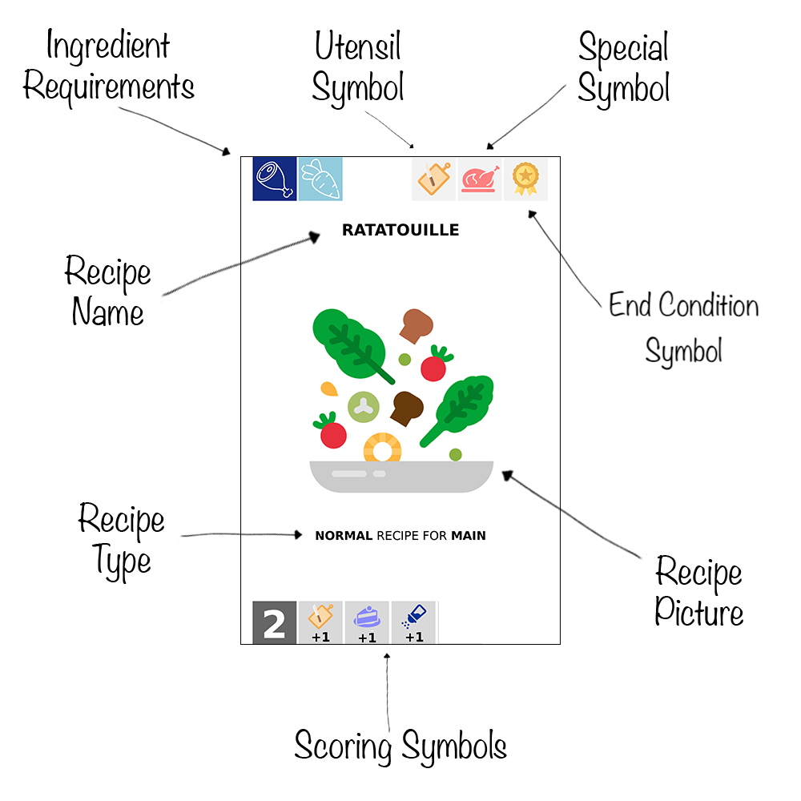

# Rules of the Game

## Table of Contents

- [Table of Contents](#table-of-contents)
- [Overview](#overview)
- [Objective](#objective)
- [Setup](#setup)
- [Turn Structure](#turn-structure)
- [Scoring](#scoring)
- [Card Types](#card-types)
  - [Ingredient Cards](#ingredient-cards)
  - [Recipe Cards](#recipe-cards)
  - [Action Cards](#action-cards)
  - [Utensil Cards](#utensil-cards)
  - [Ability Card](#ability-card)
- [Main Mechanics](#main-mechanics)
  - [Prepare Ingredients](#prepare-ingredients)
  - [Cook Recipes](#cook-recipes)
  - [Play Utensils](#put-utensils)
  - [Play Action Cards](#play-action-cards)
- [Roles](#roles)
- [Winning the Game](#winning-the-game)
- [Additional Notes](#notes-and-clarifications)
- [Quick Reference](quick-reference.md)

## Overview

You are at the mall, you did your shopping, and now you are starving so you go to the food court.
But what do you want to eat? Which restaurant will you choose? They all look so good!...

Welcome to the ultimate culinary competition! 
Each player plays as a restaurant in the mall's food court that specializes in a specific cuisine.
The restaurant is represented as a deck with unique ingredients, recipes, and abilities.  
The restaurants compete by cooking recipes, utilizing their special abilities, and striving to
achieve their win conditions.

## Objective

Be the first to achieve your deck's win condition, OR score 40 Victory Points (VP) to win.

## Setup

1. Each player chooses a deck to play with.
2. If role cards are in play, shuffle and deal them to the players.
_(The way role cards are played is explained in more detail in the [Roles](#roles) section.)_

Then each player sets up their station as they seem fit.
The below is just a suggested guide:

1. Place your deck's ability card in front of you.
2. Place your deck on your left face down, shuffle it and draw 8 cards for your starting hand.
3. On your right, you will place your discarded cards in a pile face down.
4. On the left of the ability card, you will place your win condition cards.
5. On the right of the ability card, you will place your utensils cards.
6. Above the ability card you will place your ingredients, recipes & action cards.
7. Decide the first player randomly and start the game (play proceeds clockwise).

## Turn Structure

The game is played in rounds. One round consists of all players' turns.

If role cards are in play at the beginning of the round, players play them.
_(For more details check the [Roles](#roles) section.)_

Then each player takes their turn.

During their turn, players always start by:

- Discarding up to 3 cards from their hand & drawing cards until they have 8 cards in their hand

Then they can:

- Prepare ingredients
- Cook recipes
- Put utensils in play
- Put action cards face down (in front of self or opponents)

Finally, if they decide to score VP they should:

- Flip up and resolve the action cards in front of self.
- Score VP 

As you can see you can choose to do whatever you want during your turn. The only requirement is to
fill your hand so you have something to play and to flip up and resolve all action cards in front
of you before scoring (if you decide to score this turn).

## Scoring

Scoring happens as follows:

- Score VP for:
  - recipes cooked
  - any special ability effects if eligible
  - any utensil cards that match a cooked recipe
  - any met role card condition (if in play).
- If you have a card from a cooked recipe that is used to track your win condition, place it in
your win condition tracking area. You can only put one such card per turn.

## Card Types

### Ingredient Cards

Can be:

- **Primary** - Used in all recipes.
- **Secondary** - Used in **normal** and **hard** recipes.
- **Optional** - Can be used in a recipe to grant **+1 VP**.

Ingredient cards have the following structure:

- Ingredient Icon - Represents the type of the ingredient so you can recognize it in
recipe requirements. Darker border means it is a **primary** ingredient.
- Ingredient Picture - A picture of the ingredient.
- Ingredient Description - Tells you which recipes the ingredient can be used in.
- Ingredient Type - The type of the ingredient (primary, secondary, optional).
- Ingredient Name - The name of the ingredient.
- Special Symbol - In some decks, the ingredient has a special symbol that can be used as visual
aid for certain deck mechanics. In the above example it tells you that this is a Tagliatelle
so you know if the recipe cooked with it scores extra points for using exact pasta ingredient.

### Recipe Cards

Can be:

- **Easy** - Require 1 **primary** ingredient and grant **+1 VP**.
- **Normal** - Require 1 **primary** and 1 **secondary** ingredient and grant **+2 VP**.
- **Hard** - Require 1 **primary** and 2 **secondary** ingredients and grant **+3 VP**.

Recipe cards have the following structure:

- Utensil Symbol - Depicts the utensil type that can be used to score extra VP.
- Recipe Picture - A picture of the dish.
- Recipe Description - Short description of the dish.
- Recipe Type - The difficulty of the recipe (easy, normal, hard).
- Recipe Name - The name of the dish.
- Ingredient Requirements - The ingredients needed to cook the recipe.
- Special Symbol - In some decks, the recipe has a special symbol that is used for their special
ability. In the above example it tells you that this recipe can use Tagliatelle as exact pasta
ingredient to score extra points.

Recipes have the following mechanics:

- **Normal** and **Hard** recipes can be cooked for less but score less VP accordingly. For example,
you can cook a **hard** recipe with only 1 secondary ingredient (as **normal** recipe) but you also
score only **2 VP** (as **normal** recipes do). Or cook it only with the primary ingredient as 
**easy** recipe to score only **1 VP**.
- **Hard** recipes when cooked with their ingredient requirements fully covered make all other 
recipes cooked in that turn to score extra **1 VP**. For example if you cook 1 **hard** recipe along
with 2 **easy** recipes that turn, you score extra **2 VP** for the **easy** recipes totalling to
3 + 1 + 1 + 2 = **7 VP**. This effect stacks so if you cook 2 **hard** recipes along with 1 
**easy** recipe you score 3 + 3 + 1 + 2 + 2 = **11 VP**.
- Only recipes that were cooked with their ingredient requirements fully covered participate in win
condition tracking. For example with the Italy deck if you cook the **normal** recipe "Fettuccine
Alfredo" with "Fettuccine" as **primary** ingredient only (so as an **easy** recipe) you cannot
place the "Fettuccine" ingredient card in your win condition tracking area.

### Action Cards

Can be played with either offensive or defensive effect. Offensive effects are used to disrupt
opponents. Defensive effects benefit the players themselves.  
Action cards are put face down in front of the player who they affect (you for defensive cards or
opponents for offensive cards) and are resolved (flipped back up) before scoring.

The action cards are as follows (Offensive [O] and Defensive [D]):

- **Blocking** (x3)
  - [O] Block Action - Prevent an opponent from playing an action card. 
  - [D] Block Action - Protect yourself from opponent's action card.
- **Ingredients**
  - [O] Discard Ingredient - Choose 1 prepared (used or unused) ingredient that the opponent should 
  discard.
  - [D] Reuse Ingredient - Prepare 1 ingredient card of your choice directly from your discard pile.
- **Recipes** 
  - [O] Lose Recipe - Choose 1 cooked recipe of an opponent. Shuffle the recipe card and 1 of its
  ingredients back into their draw deck. The rest of the recipe ingredients (if any) stay in play.
  - [D] Reuse Recipe - Take 1 recipe card and 1 ingredient card of your choice back from your
  discard pile to your hand.
- **Win Condition Cards**
  - [O] Disrupt Progress - Shuffle 1 win condition card of an opponent back in their draw pile.
  - [D] Restore Progress - Take 1 card suitable for win condition tracking from your discard pile
  to your hand.
- **Utensils**
  - [O] Break Utensil - Flip a utensil card of an opponent down to disable it.
  - [D] Repair Utensil - Flip a disabled utensil card of yours back up to enable it.
- **Drawing Cards**
  - [O] Discard Cards - Ask an opponent to discard 2 cards of their choice from their hand. If
  they don't have 2 cards in their hand, they instead discard 2 cards from the draw pile.
  - [D] Draw Cards - Draw 2 cards from the draw deck for your hand, disregarding the 8 cards hand 
  limit.
- **Recipe Scores**
  - [O] Score Less - Make an opponent's cooked recipe to score 1 VP less.
  - [D] Score More - Make a recipe you cooked to score 1 VP more.
- **Redistribute Cards**
  - [O] Extract Cards - Ask an opponent to draw 3 random cards directly from their draw pile and
  discard them.
  - [D] Restore Cards - Draw 3 random cards from your discard pile to the top of your draw pile. 

- Action cards can only be blocked (so discarded) by the **Block An Action** card. The card can be 
used cumulatively (so your opponent can block your block, you theirs, etc.).
- Any cards you get via action cards (i.e. via the "Draw Cards" card) can be played before scoring.
- Players always choose the targets of their action cards when possible! For example, you choose the
utensil card the opponent should disable, the recipe they should lose, etc. But you cannot choose
which cards they should discard from their hand or draw/discard cards from their piles instead of
them.

### Utensil Cards

Grant **+1 VP** for each cooked recipe that has a symbol matching the utensil.

Each deck has 3 utensil cards - **Kitchenware**, **Cookware** & **Tableware**.

### Ability Card

Explains your deck's special ability and win condition.

## Main Mechanics

### Prepare Ingredients

You put as much ingredient cards as you want from your hand in front of you. They are now counted
as prepared but unused ingredients. You can use them later to cook recipes.

### Cook Recipes

For each recipe you want to cook you need to:

- choose from the prepared unused ingredient cards.
- place them in a column with an overlap.
- put the recipe at the bottom of the column.

The recipe is now counted as cooked, and you can score from it.
Keep in mind that you are not required to cook normal and hard recipes with their full ingredient
requirements. Read more about that in the [Recipe Cards](#recipe-cards) section.

### Put Utensils

You should put utensil cards in dedicated stack. They grant **+1 VP** during scoring for each cooked
recipe that has a symbol matching the utensil. They cannot be discarded only disabled/enabled by 
the "Break/Repair Utensil" action cards.

### Play Action Cards

You can put action cards face down in front of you or your opponents. They stay face down until
you decide to score. Each action card can be played with the green text up as defensive action to
benefit you or with the red text up as offensive action to disrupt your opponents. So they should 
be put in 2 different stacks.
Before scoring you flip all action cards up and resolve their effects. "Block An Action" cards can 
be used to negate effects of other action cards. The owner of such card chooses which card it 
blocks. So your opponents decide which of your defensive action cards is blocked, and you decide
which of their offensive action cards is blocked.

## Roles

The game also comes with 6 roles represented by 12 role cards (each role is a pair of cards). They
can be put in play when 3 or more players are playing.
Each role card has a unique ability that can be used once per round. The role cards are dealt
randomly to players during the initial setup. They are played at the start of each round before
players take their turns. Role cards' abilities cannot be blocked! 

The role cards are:

- **Chef** - Choose a player to cook 1 **normal** or **hard** recipe this turn. If they manage you
and the player both gain **+2 VP**.
- **Waiter** - Choose a player to cook more than 1 recipe for this turn. If they manage you and the
player both gain **+2 VP**.
- **Dishwasher** - Ask a player to discard their new hand and fill it a second time. If they do,
they gain **+2 VP**. If they refuse, you gain **+2 VP**.
- **Supplier** - Choose a player to either take any 2 cards from their discard pile or to draw 2
cards less during their turn (so up to 6 card hand max). Then you do the same.
- **Critic** - Grants **+1 VP** to an opponent and **+1 VP** to you or **-2 VP** to an opponent
and **-1 VP** to you.
- **Customer** - Demand a player to cook a **normal** or **hard** recipe this turn. If they manage
you both gain **+2 VP**. If not, you both score **-2 VP**.

The mechanics of playing the role cards are as follows:

Setup:

Separate the pairs so that you have 2 piles of 6 cards. One pile is face up and the other is face
down. Shuffle the face down pile and deal 1 card to each player until all cards are dealt or until
each player has a role card. Then all players reveal their role cards and take the other card from
the pair from the face up pile.

Playing:

1. You receive a pair of role cards at the beginning of a round. 
2. You put one of them in front of you so you can remember what role you are playing and what is
its ability.
3. You choose your counterpart and give them the other card from the pair so they also know what
they should do during they turn.
4. If you receive a role card from another player (you were picked as someone's counterpart) you
put it in front of you to the right of your role card. 
5. At the end of the round you give your left role card to your counterpart and respectively receive
the other role card from the person who gave you your right role card. Next round you play with 
your new pair of role cards.

## Winning the Game

The game ends after the end of the round in which a player reaches 40 VP or meets its Win Condition.
(end of the round means all player have taken their turns). 
To determine the winner, calculate the VP of all players (each win condition card is worth 5 VP,
but if all 4 are present the total bonus is 30 instead of 20 VP).
If there is still a tie, the one who most recently cooked in real life wins.

## Notes And Clarifications

- Once their deck is empty, a player shuffles their discard pile to form a new draw pile. This
happens even when drawing because at all times a player must be able to draw up to a hand of 8 
cards!
