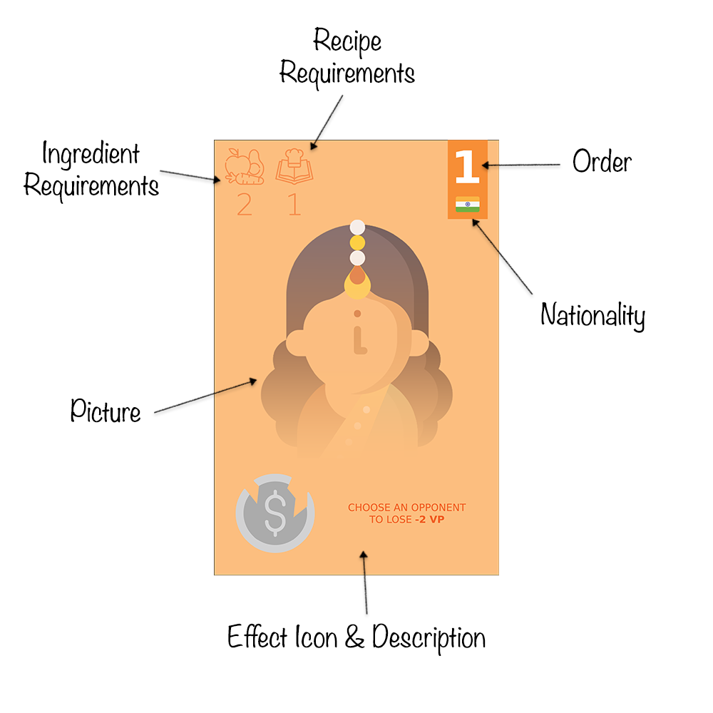
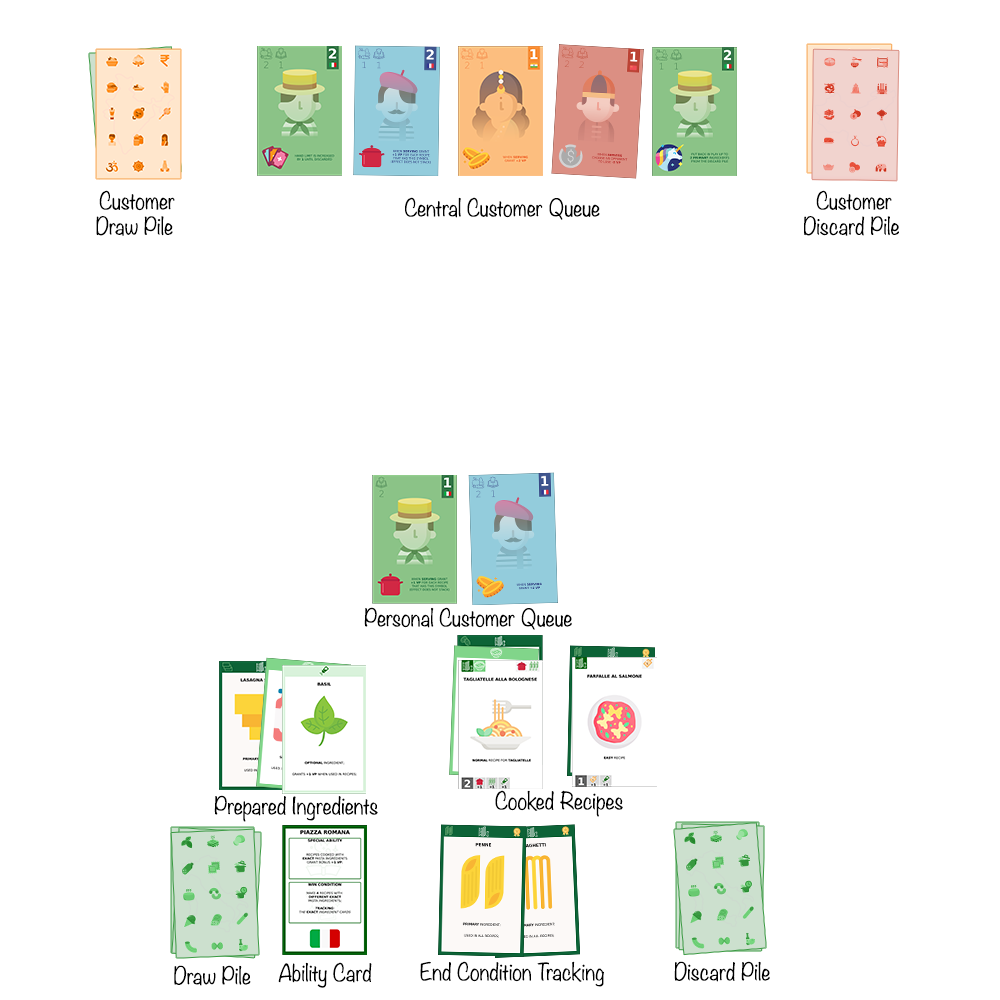

# Rules of the Game

<!-- TOC -->
* [Rules of the Game](#rules-of-the-game)
  * [Overview](#overview)
  * [Objective](#objective)
  * [Setup](#setup)
  * [Turn Structure](#turn-structure)
    * [Perform One Main Action](#perform-one-main-action)
    * [Additional Actions](#additional-actions)
  * [Card Types](#card-types)
    * [Ingredient Cards](#ingredient-cards)
    * [Recipe Cards](#recipe-cards)
    * [Drink Cards](#drink-cards)
    * [Event Cards](#event-cards)
    * [Customer Cards](#customer-cards)
    * [Ability Card](#ability-card)
  * [Player Actions](#player-actions)
    * [Fill Hand](#fill-hand)
    * [Cook](#cook)
    * [Serve](#serve)
    * [Attract Customers](#attract-customers)
    * [Play Event Cards](#play-event-cards)
    * [Play Drink Cards](#play-drink-cards)
  * [Winning the Game](#winning-the-game)
  * [Examples](#examples)
<!-- TOC -->

## Overview

Players take on the role of restaurant owners competing in a bustling mall food court. Each
restaurant specializes in a unique cuisine, represented by its own deck of cards. These decks
contain ingredients, recipes, abilities, and customers that reflect each restaurant's theme.

The goal is to prepare and serve delicious meals, attract customers, and leverage unique abilities
to earn the most Victory Points (VP) before the game ends.

## Objective

Players aim to score the highest number of Victory Points (VP) at the end of the game. VP are earned
by cooking and serving recipes, playing drink cards, triggering customer and ability effects,.

## Setup

1. **Deck Selection:** Each player selects one restaurant deck.
2. **Central Customer Queue Creation:**
    - All players remove the customer cards from their decks.
    - Combine these into a shared customer deck.
    - Shuffle the deck and draw customer cards equal to the number of players plus 1.
    - Place these face up in the center of the play area to form the **central customer queue**.
    - Place the remaining customer deck face down as draw pile, with space for a face-down discard
      pile on the opposite side of the queue.
3. **Player Station Setup:**
    - Place the **Ability Card** in front of the player.
    - Place the player deck face down on the left side as draw pile and draw 7 cards for a starting
      hand.
    - Reserve space to the right of the Ability Card for the **discard pile** and **End Condition
      Cards**.
    - Above the Ability Card, players will place their **prepared ingredients and cooked recipes**.
    - Above that, players will maintain their **personal customer queue**.
4. Choose **First Player:** randomly. Turns proceed clockwise.

Check the [Examples](#examples) section for a visual representation of the setup.

## Turn Structure

Game is played in rounds where 1 round consists of all players taking their turns clockwise.

When a player is not taking a turn they must prepare for it by discarding up to 3 cards from their
hand and then fill it up to the hand limit.

When a player is taking a turn they either **cook** or **serve** and can also play any number of 
**event** cards and **drink** cards.

### Perform One Main Action

Players **must** perform **one** of the following 2 actions:

- **Cook:** Do the below in order:
  1. Place up to 3 ingredient cards from their hand into play as **prepared but unused**.
  For more information check [Ingredient Cards](#ingredient-cards).
  2. Place up to 2 **easy** or 1 non-easy (**normal** or **hard**) recipe into play by using the
  prepared and unused ingredients to cover the recipes' requirements. For more information check
  [Recipe Cards](#recipe-cards) and [Cook](#cook).
  3. Attract 1 customer from the central queue, provided they meet its requirements. 

- **Serve:** Score Victory Points by serving cooked recipes to customers in the player’s personal
  queue. The total number of recipes that may be served is limited by the combined orders on the
  customer cards. During this action, players also resolve customer effects, special ability 
  effects and put in play cards to track end condition progress (if applicable). Every cooked recipe
  along with its ingredients that was scored from and every customer that was served and their 
  effect used are discarded at the end of that action.
  For more information check [Serve](#serve).

### Additional Actions

At the end of their turn after completing their main action players may attract 1 customer from the 
central queue if they meet its requirements. The attracted customer is added to their personal 
queue (up to a maximum of 3 customers). 
For more information check [Customer Cards](#customer-cards)

Players **may** also perform the following 2 actions **any** number of times at **any** time during
their turn:

- Play **event** cards: to manipulate the customer queues.
  For more information check [Event Cards](#event-cards).
- Play **drink** cards: to immediately score bonus VP if their conditions are met.
  For more information check [Drink Cards](#drink-cards).

## Card Types

### Ingredient Cards

Ingredient cards represent the various components needed to cook recipes. They come in three
categories:

- **Primary Ingredients** – Required in every recipe.
- **Secondary Ingredients** – Required in **normal** and **hard** recipes.
- **Optional Ingredients** – Can be added to any recipe to grant **+1 VP** when served.

Ingredient cards have the following structure:

- **Ingredient Icon** - Represents the type of the ingredient so you can recognize it in
  recipe requirements. Darker border means it is a **primary** ingredient.
- **Ingredient Picture** - A picture of the ingredient.
- **Ingredient Description** - Tells you which recipes the ingredient can be used in.
- **Ingredient Type** - The type of the ingredient (primary, secondary, optional).
- **Ingredient Name** - The name of the ingredient.
- **Special Symbol** - In some decks, the ingredient has a special symbol that can be used as visual
  aid for certain deck mechanics. In the above example it tells you that this is a Tagliatelle
  so you know if the recipe cooked with it scores extra points for using exact pasta ingredient.
- **End Condition Symbol** - If present it indicates this card can be used to track the end
  condition for the deck.

### Recipe Cards

Recipe cards represent dishes that players can cook and serve for points. They vary in complexity
and scoring potential:

- **Easy:** Requires 1 Primary Ingredient — worth 1 VP.
- **Normal:** Requires 1 Primary + 1 Secondary Ingredient — worth 2 VP.
- **Hard:** Requires 1 Primary + 2 Secondary Ingredients — worth 4 VP.

Recipe cards have the following structure:

- **Utensil Symbol** - Depicts the utensil type that can be used to score extra VP.
- **Recipe Picture** - A picture of the dish.
- **Recipe Type** - The difficulty of the recipe (easy, normal, hard).
- **Recipe Name** - The name of the dish.
- **Ingredient Requirements** - The ingredients needed to cook the recipe.
- **Special Symbol** - In some decks, the recipe has a special symbol that is used for their special
  ability. In the above example it tells you that this recipe is a Main course recipe.
- **Scoring Symbols** - Used to calculate the total score of the recipe when serving. It includes a
  base score and various situational bonuses (from special abilities, optional ingredients, etc.).
- **End Condition Symbol** - If present it indicates this card can be used to track the end
  condition of the deck.

### Drink Cards

Drink cards represent beverages that customers can enjoy. Unlike recipes, drinks require no
ingredients and can be played at any time as long as:

- players have at least one customer in their personal customer queue.
- the drink card's condition is met.

When a drink card is put in play it grants 3 VP and is instantly discarded.
Customers are not discarded when served with a drink card!

Drink cards have the following structure:

- **Customer Requirements** - Visual reminder that at least 1 customer has to be present in the
player's personal queue in order to serve drinks.
- **Drink Name** - The name of the drink.
- **Drink Symbol** - Indicates that this is a drink card.
- **Drink Picture** - A picture of the drink.
- **Scoring Condition** - Describes what needs to be in place so that the player can score from the
drink card.
- **Scoring Bonus** - How much a player scores from the drink card if its condition is met.

### Event Cards

Event cards provide one-time strategic effects that can impact any player's queue. They are:

- **Complaint:** Discards a customer from any queue.
- **Promotion:** Swaps 2 customers from any two queues.
- **Discount:** Allows a player to attract a customer from the central queue, ignoring its
  requirements and the limit of attracting only 1 customer per turn.

Event cards can be played at any time during a player’s turn.

Event cards have the following structure:

- **Event Name** - The name of the event.
- **Event Picture** - Visual representation of the event.
- **Event Description** - Describes what the event does.

### Customer Cards

Customer cards represent diners that players try to attract and serve. They are drawn from a shared
central queue and added to individual player queues when requirements are met. Each customer
increases the player’s serving capacity and grant various effects.

Customer cards have the following structure:

- **Ingredient Requirements** - The **prepared** and **unused** ingredient cards needed to
  attract the customer to the player's queue.
- **Recipe Requirements** - The **cooked** recipe cards needed to attract the customer to the
  player's queue.
- **Order** - The number of recipes that can be served to the customer. The sum of this number 
  across all customer cards in the player's queue is the total number of recipes that can be served
  (scored from) during the **Serve** action.
- **Nationality** - Indicates the customer's nationality which may provide bonus VP when served,
  depending on the active customer effect.
- **Effect Icon & Description** - The effect granted by the customer card which is either activated
  when served or is an ongoing effect until the card is discarded after serving.

**Notable Rules:**

- Players may attract 1 customer per turn (unless using a Discount event card).
- Players may have a maximum of 3 customers in their personal queue.
- Customer effects that are not ongoing only activate if at least one recipe is served to them.
- Customer effects that are ongoing apply immediately when the card is put in play and are active
  while the customer remains in the queue.
- Effects do not stack if duplicated.

**Deck-Specific Customer Effects Include:**

- VP gain/loss.
- Discarding prepared ingredients.
- Reshuffling cooked recipes back into the deck.
- Bonus VP for utensil types or nationalities.
- Deck-unique effects (e.g., recovering ingredients or recipes from the discard pile).

See [Decks](Decks.md) for specific configurations.

### Ability Card

Each deck includes an ability card that outlines:

- The deck’s unique ability.
- The end condition and how to track it.

Players can use this to guide their strategy and scoring plan.

## Player Actions

### Fill Hand

Outside their turn, players discard up to 3 cards and then draw up to their hand limit. 
Normally this limit is 7 but can be 8 if they have active the hand limit increase customer effect.
If the draw pile is empty or does not have enough cards, the discard pile is reshuffled into it.

### Cook

Players move up to 3 ingredient cards from their hand into play. These become **prepared but
unused** ingredients, which remain available for cooking recipes.

Players then use the prepared unused ingredients to fulfill a recipe’s requirements:

- Ingredients are arranged in a column.
- The matching recipe card is placed on top of the stack.

Up to 2 **easy** or 1 non-easy (**normal** or **hard**) recipe can be cooked per turn!

The above picture demonstrates that the player can do one of the following:

- Prepare 1 primary, 1 secondary and 1 optional ingredient and cook 1 normal recipe.
- Prepare 2 primary and 1 optional ingredients and cook 2 easy recipes.

### Serve

Players serve up to as many recipes as allowed by the total orders from their customers.
Points are scored from:

- The cooked recipes.
- Active customer effects.
- Ability card effects.
- Situational bonuses.

If one or more served recipes qualify for end condition tracking, **one** such card may be placed 
into the tracking area! Players cannot put more than 1 end condition card into tracking per turn.

### Attract Customers

Before ending their turn (after completing the main action), players may attract 1 customer from 
the central queue if the card's requirements are met. This customer is added to the player’s queue 
(max 3). Their order number expands the player’s serving limit for future Serve actions. 
For more details, see [Customer Cards](#customer-cards).

### Play Event Cards

Players may play event cards (Complaint, Promotion, Discount) to manipulate customer queues at any
time during their turn. For more details, see [Event Cards](#event-cards).

### Play Drink Cards

At any time during a turn when the condition of a drink card is met, it may be played to grant 
extra VP. For more details, see [Drink Cards](#drink-cards).

## Winning the Game

The game ends after the round in which a player puts 4 End Condition cards into tracking. 
All players must finish their turns so a round could end.

After the game ends the winner is the one with the most VP (each End Condition card in tracking 
grants 2VP to the total VP score of a player).

If there is a tie the player who most recently cooked a real-life meal wins.

## Examples

In this 4-player game example only one player station and the central queue is shown:

- The visible player is using the **Piazza Romana** deck.
- They have 2 end condition cards in tracking (2 more needed).
- They have 3 prepared ingredients: 1 primary, 1 secondary, 1 optional.
- They have cooked 2 recipes: 1 easy, 1 normal.
- Their queue includes 2 customers with a combined total order of 2.

If the player serves now they will score:
- **Normal Recipe:** 2 base VP + 1 VP bonus from the Cookware utensil effect = 3 VP.
- **Easy Recipe:** 1 VP.
- **French Customer Effect:** +2 VP.

**Total VP Earned:** 6
